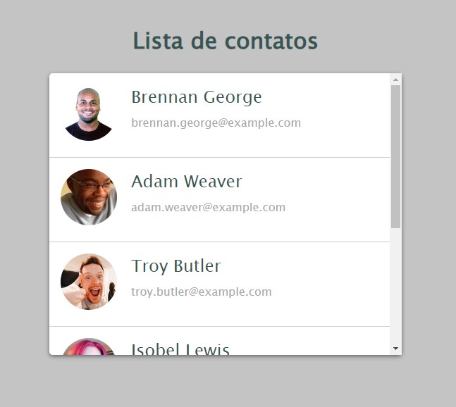

# Lista de Contatos Convencional

Este é um projeto de estudo desenvolvido com HTML5 e CSS para apresentar uma lista de contatos de forma convencional. Este projeto é parte de um exercício de prática para demonstrar habilidades em desenvolvimento web.

## Descrição do Projeto

O objetivo deste projeto é criar uma lista de contatos utilizando uma abordagem convencional, mas eficaz. Embora a apresentação visual possa não ser tão inovadora quanto outras abordagens, o foco está na funcionalidade e usabilidade da lista de contatos.

## Funcionalidades

- Apresentação convencional da lista de contatos.
- Layout simples e funcional.
- Utilização de técnicas básicas de HTML5 e CSS para criar uma lista de contatos eficaz.

## Captura de Tela

